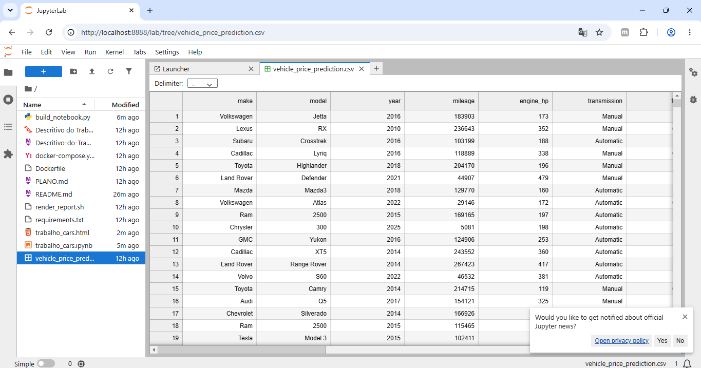
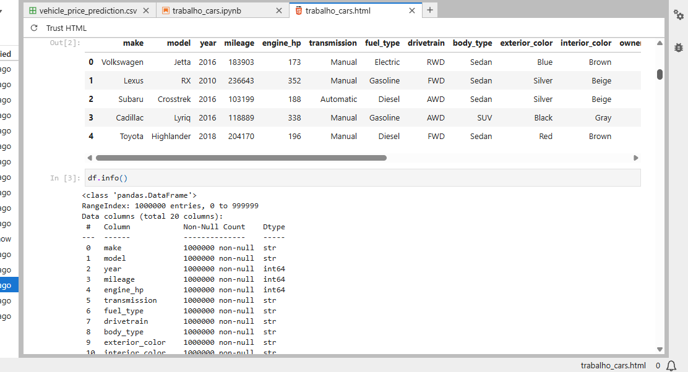
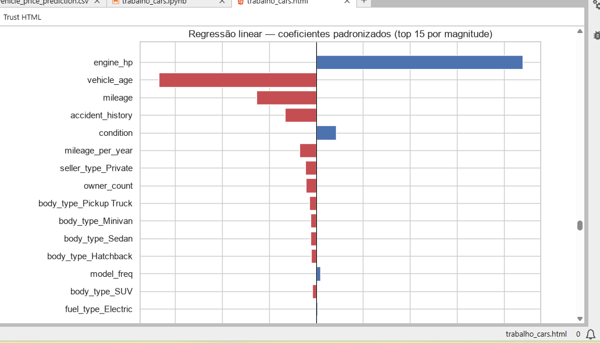
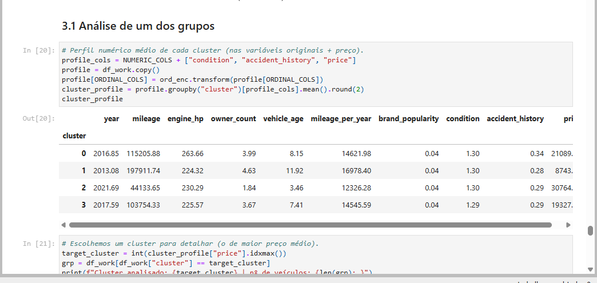
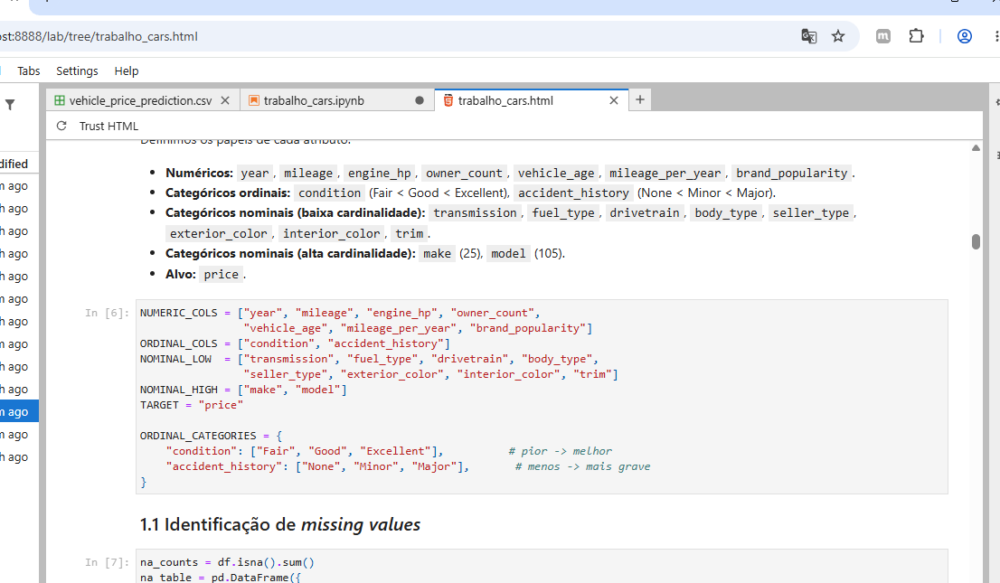
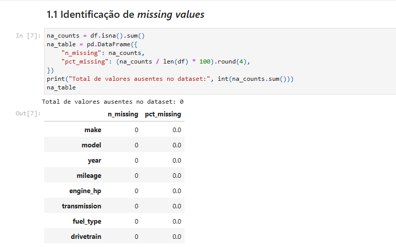

# 🚗 Análise de Preços de Veículos (Trabalho Final — GETI)

Este repositório contém o Trabalho Final da disciplina **Gestão e Análise de Dados — GETI** do Instituto Federal de São Paulo (IFSP), Câmpus Bragança Paulista.

O objetivo do projeto é realizar uma análise de dados completa sobre um dataset de **1 milhão de veículos** do mercado dos Estados Unidos, aplicando técnicas de pré-processamento, regressão linear múltipla, agrupamento (K-means) e busca por similaridade (K-NN).

---

## 📸 Demonstração do Projeto

<p align="center">
  
</p>

### 📊 Galeria de Resultados (`trabalho_cars.html`)

Abaixo estão os destaques das etapas de análise executadas sobre o dataset completo:

<table align="center" width="100%">
  <tr>
    <td align="center" width="50%" valign="top">
      <h4>⚙️ 1. Configuração e Carga dos Dados</h4>
      
      <p><i>Leitura e exploração inicial do dataset de 1 milhão de registros.</i></p>
    </td>
    <td align="center" width="50%" valign="top">
      <h4>📈 2. Regressão Linear Múltipla</h4>
      
      <p><i>Coeficientes padronizados mostrando o impacto das variáveis no preço.</i></p>
    </td>
  </tr>
  <tr>
    <td align="center" width="50%" valign="top">
      <h4>🎯 3. Análise dos Grupos (K-means)</h4>
      
      <p><i>Perfil detalhado de médias e frequências do cluster selecionado.</i></p>
    </td>
    <td align="center" width="50%" valign="top">
      <h4>🖥️ 4. Visão do Relatório HTML</h4>
      
      <p><i>Layout final exportado do trabalho compilado.</i></p>
    </td>
  </tr>
  <tr>
    <td align="center" colspan="2" valign="top">
      <h4>📊 5. Visualizações e Dispersão</h4>
      
      <p><i>Gráficos dinâmicos de dados faltantes e coeficientes da regressão.</i></p>
    </td>
  </tr>
</table>

---

## 🛠️ Tecnologias e Bibliotecas Utilizadas

O projeto é desenvolvido em **Python** e utiliza as seguintes bibliotecas principais para ciência de dados:

1. **`pandas`**: Manipulação, limpeza e análise estruturada de dados. É usada para carregar o arquivo CSV de 127 MB, fazer filtros, gerar tabelas de estatísticas e codificar variáveis categóricas.
2. **`numpy`**: Computação numérica de alta performance. Utilizada para manipulação de arrays e geração de valores aleatórios (como na simulação de valores ausentes).
3. **`scikit-learn (sklearn)`**:
   - **`SimpleImputer`**: Utilizado para demonstrar a técnica de imputação de dados ausentes (preenchimento com a mediana ou moda).
   - **`OrdinalEncoder`**: Converte variáveis categóricas que possuem uma ordem intrínseca (ex: condição do carro de _Fair_ a _Excellent_) em números inteiros.
   - **`StandardScaler`**: Padroniza os dados numéricos (z-score, média 0 e desvio padrão 1), o que é indispensável para algoritmos de distância (como K-means e K-NN).
   - **`MiniBatchKMeans`**: Versão otimizada e rápida do K-means para grandes volumes de dados (1 milhão de registros), dividindo o dataset em clusters (grupos) com base em suas características.
   - **`NearestNeighbors`**: Implementação do K-NN (K-Nearest Neighbors) para encontrar de forma eficiente os 5 veículos mais parecidos com um carro de referência.
   - **`PCA` (Principal Component Analysis)**: Reduz a dimensionalidade dos dados padronizados para 2 dimensões, permitindo plotar e visualizar graficamente os clusters formados pelo K-means.
   - **`silhouette_score`**: Calcula a métrica de silhueta para validar a qualidade do agrupamento.
4. **`statsmodels`**: Biblioteca de modelagem estatística. Utilizada na **Regressão Linear Múltipla** para obter um sumário estatístico detalhado (coeficientes, R², valor-P) e quantificar a importância de cada atributo no preço.
5. **`matplotlib` & `seaborn`**: Criação de gráficos estáticos e dinâmicos para visualização de dados (frequências de dados nulos, coeficientes da regressão, curvas de cotovelo/silhueta e gráficos de dispersão dos clusters).
6. **`nbformat`**: Utilizado no script de automação (`build_notebook.py`) para gerar programaticamente o notebook Jupyter `.ipynb`.

---

## 🎯 Objetivo do Trabalho (Tarefas)

O projeto realiza as seguintes etapas obrigatórias:

### 1. Pré-processamento ([Tarefa 5.1](Descritivo-do-Trabalho.md#L37))

- **Identificação de Missing Values**: Varredura por dados faltantes. O dataset original é 100% limpo, mas há um tratamento correto para a string `"None"` na coluna de acidentes para evitar que o Pandas a interprete incorretamente como nula (o que geraria ~1/3 de valores nulos falsos).
- **Demonstração de Imputação**: Injeção artificial de dados nulos em uma subamostra e preenchimento com `SimpleImputer` (mediana para numéricos e moda para categóricos) como demonstração de técnica.
- **Codificação Categórica**:
  - _Ordinal Encoding_ para as variáveis `condition` e `accident_history`.
  - _One-Hot Encoding_ para nominais com poucas categorias.
  - _Frequency Encoding_ para nominais com alta cardinalidade (`make` e `model`).
- **Normalização**: Aplicação do `StandardScaler` para deixar as variáveis na mesma escala.

### 2. Regressão Linear Múltipla ([Tarefa 5.2.1](Descritivo-do-Trabalho.md#L46))

- Treinamento de um modelo linear (`statsmodels.OLS`) para explicar a variável alvo `price`.
- Remoção de variáveis perfeitamente colineares (como `year` e `vehicle_age`).
- Exibição do R-Quadrado (R²), coeficientes de cada feature e valor-P para entender quais variáveis são estatisticamente significativas e quais mais influenciam o preço final dos automóveis.

### 3. Agrupamento com K-means ([Tarefa 5.2.2](Descritivo-do-Trabalho.md#L52))

- Definição do número ideal de clusters ($k$) usando o método do cotovelo (inércia) e coeficiente de silhueta.
- Treinamento do `MiniBatchKMeans` no dataset de 1M de linhas.
- Análise detalhada do perfil de um dos grupos formados (médias de ano, milhas, preços, marcas e condições predominantes).

### 4. Busca de Semelhantes com K-NN ([Tarefa 5.2.3](Descritivo-do-Trabalho.md#L58))

- Busca pelos 5 carros mais parecidos com um veículo de referência (índice 0).
- Verificação cruzada se os vizinhos mais próximos também foram agrupados no mesmo cluster pelo K-means, validando a consistência dos algoritmos.

---

## 🚀 Como Executar o Projeto

Você pode rodar este projeto de duas formas (Docker ou Ambiente Python Local).

### Opção A: Rodando com Docker (Recomendado)

O Docker garante que todas as bibliotecas estarão na versão correta sem a necessidade de instalar o Python diretamente no seu computador.

1. Certifique-se de que o **Docker Desktop** está aberto e rodando no seu computador.
2. Na raiz da pasta do projeto, execute o comando para construir e iniciar o container:
   ```powershell
   docker compose up --build
   ```
3. Abra o navegador e acesse o JupyterLab no endereço:
   ```
   http://localhost:8888/lab
   ```
4. Dentro do JupyterLab, abra o arquivo `trabalho_cars.ipynb` e execute as células.

_Para gerar o relatório final `trabalho_cars.html` compilado diretamente via linha de comando no container, execute:_

```powershell
docker compose run --rm jupyter bash render_report.sh
```

---

### Opção B: Rodando Localmente (Sem Docker)

Se preferir rodar localmente e já tiver o Python instalado:

1. Crie e ative um ambiente virtual:
   ```powershell
   python -m venv .venv
   .venv\Scripts\activate
   ```
2. Instale as dependências:
   ```powershell
   pip install -r requirements.txt
   ```
3. (Opcional) Gere o arquivo do notebook a partir do script de compilação:
   ```powershell
   python build_notebook.py
   ```
4. Inicie a interface do Jupyter Lab:
   ```powershell
   jupyter lab
   ```
5. Para compilar o arquivo final do relatório HTML:
   ```powershell
   jupyter nbconvert --to html --execute --ExecutePreprocessor.timeout=3600 --output trabalho_cars.html trabalho_cars.ipynb
   ```
